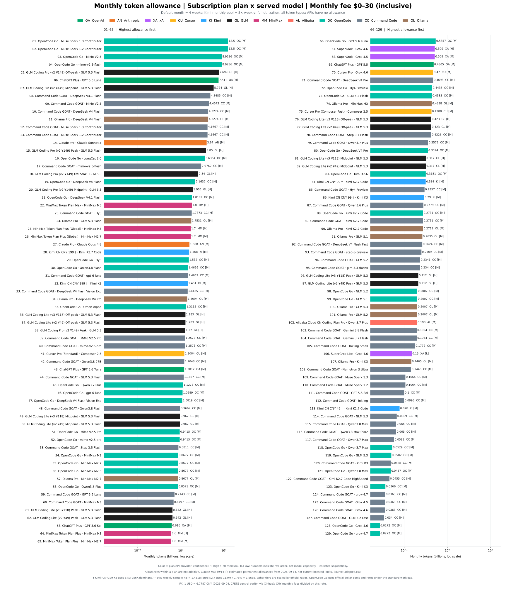
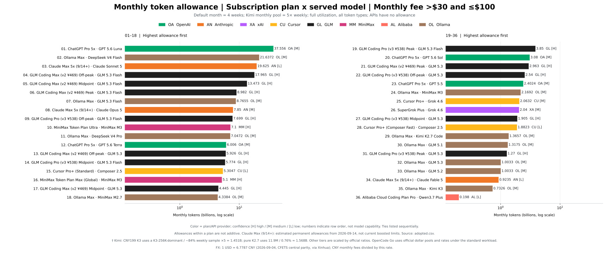
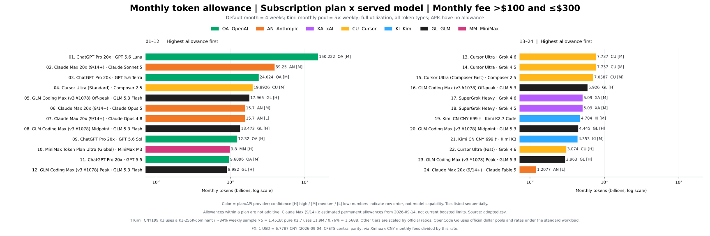
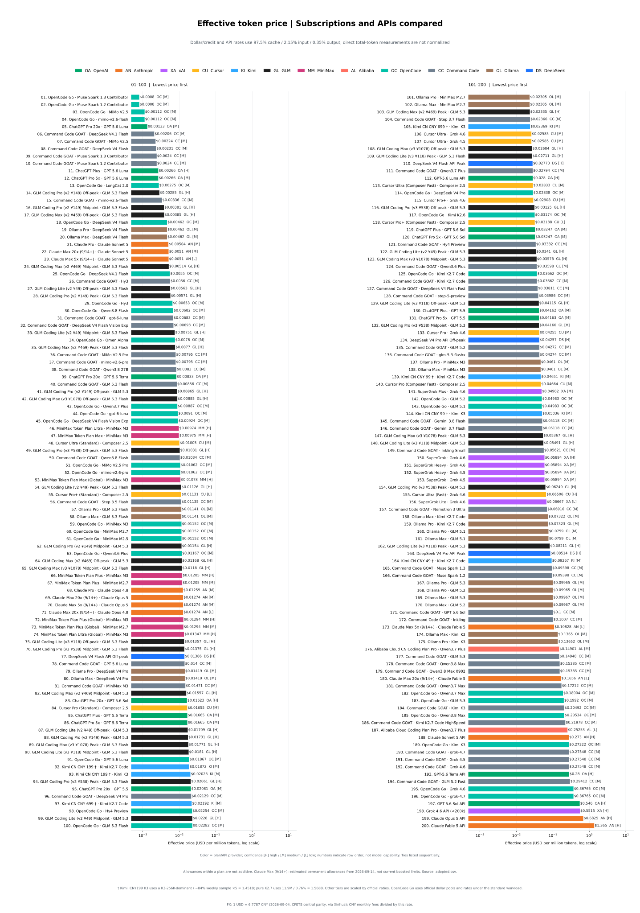
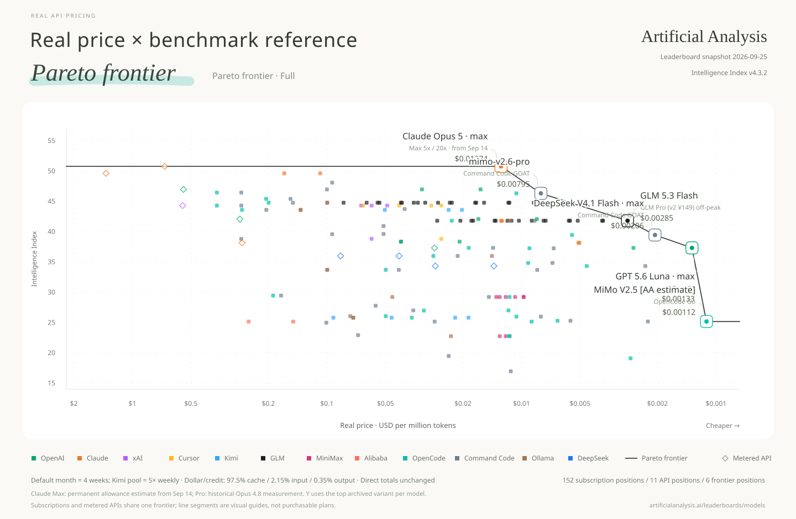

## [Explore the interactive website →](https://real-api-pricing.vercel.app)

Compare models, prices and allowances · English / 中文

**English** | [中文](README.zh.md)

# Real API Pricing

**Real unit price = monthly subscription fee ÷ monthly usable tokens.**

Full adopted data is shown first, followed by one Pareto chart per leaderboard. Monthly figures default to four weeks of saturated use; vendor-defined monthly pools remain as defined (Kimi's monthly pool is 5× its weekly pool). Input, output and cache tokens are all included. Prices use a logarithmic axis, with cheaper points farther right.

Dollar/credit pools and three-part token prices are converted with one project-wide standard workload: **97.5% cache reads, 2.15% fresh input, and 0.35% output**. This is a comparison convention, not a claim about any provider's actual workload. Measurements that already report total tokens—dashboard back-calculations, local usage logs, controlled saturation tests, and official absolute-token tables—are not normalized again. Where only total tokens and a cost-weighted percentage are available but the token-type split is unknown, the observed total is retained and the limitation is recorded rather than inventing a split. Cache writes are not modeled separately; where a provider charges for them, converted token allowances may be overstated. See [conventions](data/conventions.json) and the [token-mix audit](data/research/token-mix-audit-round2-2026-09-07.json).

GLM Coding Plan is recomputed from Zhipu's official weekly credits and cache/input/output coefficients under the same standard workload. Peak, midpoint and off-peak scenarios are shown separately instead of copying the official 95%-cache example table. A Caijing saturation-cost test and community evidence are consistent in scale, but there is still no fully specified independent V3 Pro/Max saturation test. See the [official-table archive](data/research/quotas-web-2026-09.json) and [community-evidence review](data/research/glm-community-round1-2026-09-07.json).

Each chart uses scores from its named leaderboard only. Code Arena here specifically means the WebDev Overall Arena Score, not general coding ability. GPT-5.6 Luna now uses a ChatGPT Plus dashboard measurement: 112.67 million total tokens consumed about 6% of the weekly allowance, giving 7.511 billion tokens/month for Plus. The 5x and 20x plans are scaled from that measured Plus baseline, so the rightmost Luna point is 150.222 billion tokens/month at medium confidence rather than the superseded 240.24 billion Sol-credit derivation. Claude Max's 15.7 billion-token estimate applies to the permanent terms from September 14, 2026, not a promotional ceiling. Chinese charts use 100-million-token units: 77.37 in Chinese equals 7.737 billion in English.

**[All charts: English / 中文, SVG / PNG](charts/README.md)** · [English files](charts/en/) · [中文文件](charts/zh/)

## Data snapshot

AA Intelligence now uses **Intelligence Index v4.3** (announced September 7, 2026); AA Coding Agent remains **v1.4**. The new intelligence methodology replaces the old snapshot as a whole: lower numerical scores are not evidence of model regression across index versions. All configurations within the selected snapshot are retained, including explicitly marked AA estimates. Historical evidence stays in `data/research/`.

Snapshot: 2026-09-09. Each row is one **plan × actual served model**; allowances of different models under the same plan are alternatives and must not be added together.

| Coverage | Rows |
|---|---:|
| All adopted plan × model points | 188 |
| Subscription points with monthly allowance | 177 |
| Metered API baselines | 11 |
| OpenCode Go / Command Code GOAT / Ollama models | 28 / 38 / 20 |
| Code Arena / Agent Arena scored points | 138 / 142 |
| AA Intelligence / AA Coding Agent scored points | 169 / 73 |

**Download the data:** [adopted values (CSV)](data/adopted.csv) · [computed points (CSV)](derived/points.csv) · [computed points (JSON)](derived/points.json) · [data notes and score coverage](data/README.md) · [dated evidence](data/research/)

## Personal subscription selector

The public charts answer which plans look efficient in general. The personal selector answers a narrower question: which model should run a specific job on subscriptions you already have?

It filters before it ranks. A candidate must be reviewed for the use case, have a currently observed route, enough context, a recently served model version, current ZDR evidence, a minimum quality score, and comparable capacity evidence. Only survivors enter the capacity and quality Pareto frontier. This prevents a cheap but old or weak model from winning on token volume alone.

The example profile is tuned for long-context Hermes compression. It includes OpenCode Go and Command Code GOAT, requires 1M context and ZDR, rejects served versions older than 90 days, and applies an AA Intelligence quality floor. Local subscription and probe evidence belongs in ignored files so credentials and private account details are never committed.

```bash
cp config/personal-selector.example.json config/personal-selector.json
cp data/runtime-evidence.example.json data/runtime-evidence.json
python scripts/select_personal_pareto.py \
  --profile config/personal-selector.json \
  --runtime data/runtime-evidence.json
```

Command Code strict ZDR is deliberately fail-closed for capacity ranking. Provider API access does not identify the account's exact plan. Its documentation also says ZDR uses the plan's default allowance and variable pass-through upstream pricing. The normal GOAT row is not treated as comparable until the tier is verified and runtime usage evidence establishes the effective rate.

## Monthly allowance overview

The 177 subscription plan × model points are split by adopted USD monthly fee so GitHub can show them without packing every bar into one chart: **$0–30 inclusive**, **>$30 and ≤$100**, **>$100–$300**. Each band ranks monthly usable tokens independently. The undivided chart and hybrid-scale view stay in the [chart index](charts/README.md).

### $0–30

[English SVG](charts/en/overview/monthly-allowance-overview-fee-0-30-usd.svg) · [中文 SVG](charts/zh/overview/额度总览_月费0-30美元.svg) · [English PNG](charts/en/overview/monthly-allowance-overview-fee-0-30-usd.png) · [中文 PNG](charts/zh/overview/额度总览_月费0-30美元.png)



**Table:** [English TXT](charts/en/overview/monthly-allowance-overview-fee-0-30-usd-table.txt) · [中文 TXT](charts/zh/overview/额度总览表_月费0-30美元.txt)

### >$30–$100

[English SVG](charts/en/overview/monthly-allowance-overview-fee-30-100-usd.svg) · [中文 SVG](charts/zh/overview/额度总览_月费30-100美元.svg) · [English PNG](charts/en/overview/monthly-allowance-overview-fee-30-100-usd.png) · [中文 PNG](charts/zh/overview/额度总览_月费30-100美元.png)



**Table:** [English TXT](charts/en/overview/monthly-allowance-overview-fee-30-100-usd-table.txt) · [中文 TXT](charts/zh/overview/额度总览表_月费30-100美元.txt)

### >$100 and ≤$300

[English SVG](charts/en/overview/monthly-allowance-overview-fee-100-300-usd.svg) · [中文 SVG](charts/zh/overview/额度总览_月费100-300美元.svg) · [English PNG](charts/en/overview/monthly-allowance-overview-fee-100-300-usd.png) · [中文 PNG](charts/zh/overview/额度总览_月费100-300美元.png)



**Table:** [English TXT](charts/en/overview/monthly-allowance-overview-fee-100-300-usd-table.txt) · [中文 TXT](charts/zh/overview/额度总览表_月费100-300美元.txt)

## Real unit price overview

All 188 subscription and API points on one comparable $/MTok scale.

[English SVG](charts/en/overview/real-price-overview.svg) · [中文 SVG](charts/zh/overview/单价总览.svg) · [English PNG](charts/en/overview/real-price-overview.png) · [中文 PNG](charts/zh/overview/单价总览.png)



**Full table:** [English TXT](charts/en/overview/real-price-overview-table.txt) · [中文 TXT](charts/zh/overview/单价总览表.txt)

## Pareto charts by leaderboard

Using Real API Pricing as a new baseline, we plot each leaderboard's scores on the Y-axis to redraw its Pareto frontier; the connected line represents that frontier. Subscriptions and metered APIs follow the same dominance rule and both participate in frontier selection.

### Code Arena

[English SVG](charts/en/pareto/pareto-code-arena.svg) · [中文 SVG](charts/zh/pareto/帕累托_CodeArena榜.svg) · [English PNG](charts/en/pareto/pareto-code-arena.png) · [中文 PNG](charts/zh/pareto/帕累托_CodeArena榜.png)


### Agent Arena

[English SVG](charts/en/pareto/pareto-agent-arena.svg) · [中文 SVG](charts/zh/pareto/帕累托_AgentArena榜.svg) · [English PNG](charts/en/pareto/pareto-agent-arena.png) · [中文 PNG](charts/zh/pareto/帕累托_AgentArena榜.png)


### AA Intelligence

[English SVG](charts/en/pareto/pareto-aa-intelligence.svg) · [中文 SVG](charts/zh/pareto/帕累托_AA智力榜.svg) · [English PNG](charts/en/pareto/pareto-aa-intelligence.png) · [中文 PNG](charts/zh/pareto/帕累托_AA智力榜.png)



### AA Coding Agent

[English SVG](charts/en/pareto/pareto-aa-coding-agent.svg) · [中文 SVG](charts/zh/pareto/帕累托_AA编程Agent榜.svg) · [English PNG](charts/en/pareto/pareto-aa-coding-agent.png) · [中文 PNG](charts/zh/pareto/帕累托_AA编程Agent榜.png)


AA Coding Agent scores describe tested harness × model × effort configurations. Static charts and `points.*` are explicitly **highest archived configuration reference summaries**. They are not measurements of each subscription/API channel; quota-measurement effort and product harness alignment remain unverified. Higher effort does not automatically change $/MTok; it can change tokens consumed per task.

[All-configuration interactive view (Chinese)](charts/zh/pareto/帕累托交互图.html) defaults to every archived configuration and offers the highest-score summary as an option. Download the HTML and open it locally with network access for Plotly. All configurations currently use reference mappings, not a verified product-configuration frontier.

The [configuration archive (JSON)](derived/benchmark-configurations.json) / [CSV](derived/benchmark-configurations.csv) retains all 128 records, original labels, known harness/effort, 30 source score intervals, and 70 source task-cost records. The [plan-to-configuration mappings (JSON)](derived/benchmark-points.json) / [CSV](derived/benchmark-points.csv) contains 604 explicit references, including lower-effort variants. Composer Standard/Fast require their own mode; a missing mode stays unscored. Unknown harnesses, efforts and intervals stay null.

Source mean and median task costs are separate fields, not subscription task costs. Score intervals are preserved and available in interactive hover details, but uncertainty does not yet change frontier membership. Numerical quota ranges, robust-frontier analysis and workload sensitivity remain follow-up work; qualitative confidence labels are not numerical error bars.

## Method and reproduction

[Build instructions](BUILD.md) · [Data documentation](data/README.md) · [Sources and attribution](SOURCES.md)

## License and acknowledgements

Original software: [MIT](LICENSE). Data references include [Awesome Coding Plan](https://github.com/mahonzhan/awesome-coding-plan) (CC BY 4.0) and the Caijing article 《Token经济，中国账本》. See [SOURCES.md](SOURCES.md) for attribution, changes and third-party terms.
