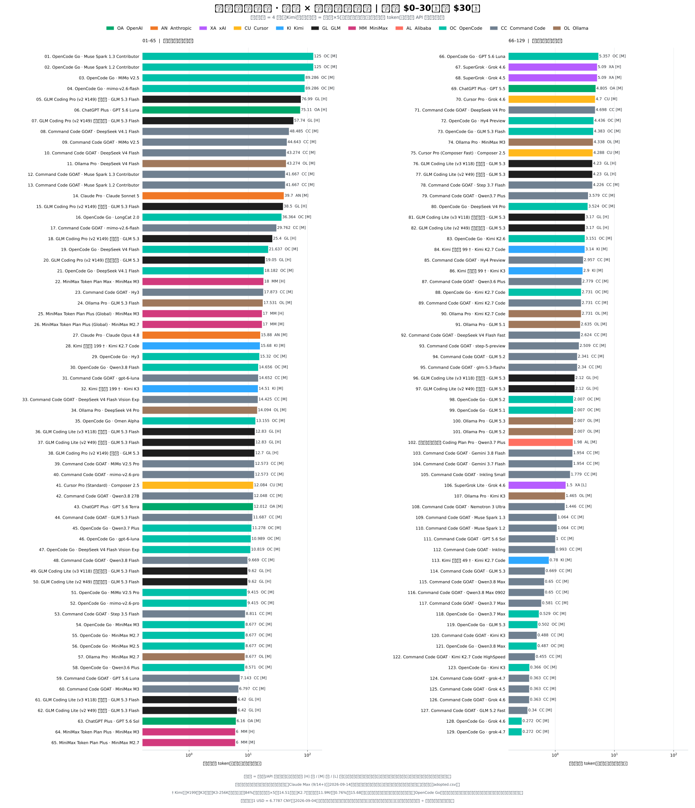
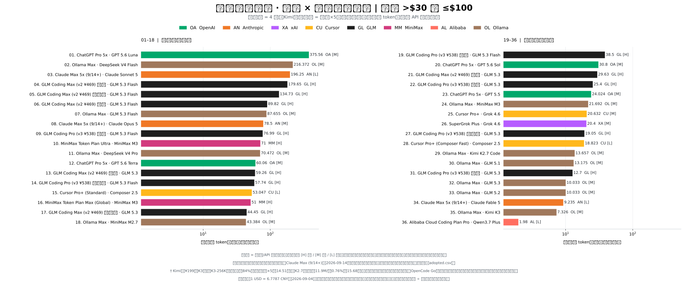
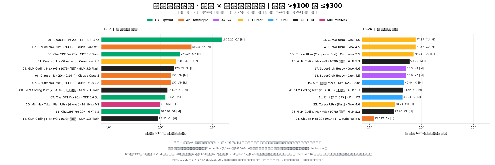
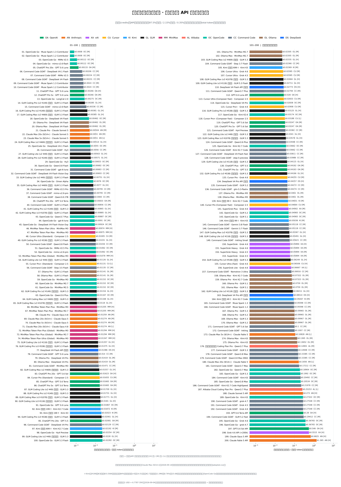
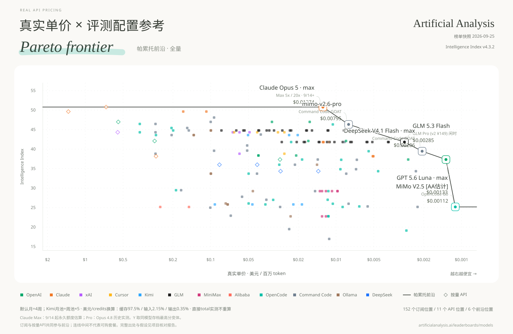

## [打开交互网站 →](https://real-api-pricing.vercel.app)

自选模型，对比价格与额度 · 支持中英文

[English](README.md) | **中文**

# 真实 API 定价

**真实单价 = 订阅月费 ÷ 每月实际可用 token。**

先展示完整采用数据，再按榜单展示帕累托图。默认按饱和使用、每月四周计算；厂商另设独立月池时保留厂商口径（Kimi 月池为周池5倍）。输入、输出与缓存 token 全部计入；单价使用对数轴，越右越便宜。

凡是由美元/credits 额度和缓存、输入、输出三段价格换算 token，统一使用项目标准负载：**缓存读取 97.5%、普通输入 2.15%、输出 0.35%**。这是统一比较口径，不代表任何厂商或用户的实际负载。已经直接给出 total tokens 的面板反推、本地日志、受控跑满和官方绝对 token 表不再重复归一；只有 total tokens 和按费用扣减的百分比、但缺 token 类型拆分时，保留实际观测并明确限制，不编造组成。当前标准不单列 cache write；厂商另收缓存写入费时，换算结果可能偏高估 token。详见[统一口径](data/conventions.json)与[token 组成审计](data/research/token-mix-audit-round2-2026-09-07.json)。

GLM Coding Plan 现已改用智谱官方周积分和缓存/输入/输出三段积分系数，并按同一标准负载重算；忙时、中间值和闲时三个情景分开展示，不再直接抄官方95%缓存示例表。《财经》跑满成本和社区证据在量级上吻合，但目前仍没有信息完整的 V3 Pro/Max 独立跑满样本。详见[官方表存档](data/research/quotas-web-2026-09.json)与[社区证据复核](data/research/glm-community-round1-2026-09-07.json)。

四张图的 Y 轴分别取自对应榜单，分数互不混用。这里的 Code Arena 特指 WebDev Overall 的 Arena Score，不代表通用编程能力。GPT-5.6 Luna 现改用 ChatGPT Plus 用户面板实测：1.1267亿 total tokens 约占周额度6%，反推 Plus 75.11亿/月；5x、20x从这条实测基准按官方倍率推算，因此最右侧 Luna 点为1502.22亿/月、置信度 medium，不再采用旧的2402.4亿 Sol credits等池派生值。Claude Max 157亿则是2026年9月14日起永久口径的估算，不是活动期上限。中文图以“亿”为单位，英文图以 billion 为单位，77.37亿对应7.737 billion。

**[全部图表：中英文、SVG / PNG](charts/README.md)** · [English files](charts/en/) · [中文文件](charts/zh/)

## 数据快照

AA 智力榜改用 **Intelligence Index v4.3**（2026-09-07 发布），AA Coding Agent 仍为 **v1.4**。智力榜按新版整榜替换，不能把跨版本分数降低解释为模型能力退步。保留选定快照内的全部配置，并明确标注 AA 估计值；历史证据继续保存在 `data/research/`。

快照日期：2026-09-25（AA 智力榜于 2026-09-25 重读；Code Arena、Agent Arena 与 AA 编程 Agent 榜分别沿用 2026-09-05 / 2026-09-01 / 2026-09-09 快照）。每行代表一个**套餐 × 实际服务模型**；同一套餐下不同模型的额度是替代关系，不能相加。

| 覆盖范围 | 行数 |
|---|---:|
| 全部采用的套餐 × 模型点 | 200 |
| 有月额度的订阅点 | 189 |
| 按量 API 基准点 | 11 |
| OpenCode Go / Command Code GOAT / Ollama 模型 | 33 / 45 / 20 |
| Code Arena / Agent Arena 有分点 | 138 / 142 |
| AA 智力榜 / AA 编程 Agent 榜有分点 | 178 / 73（含10条标注代理估计后为 193 / 73） |

### 代理估计值（明确标注，绝不隐式）

有十个套餐点是 AA 尚未评测的配置。它们既不留空，也不冒充实测值：标定过程写在
`scripts/proxy_estimates.py`，快照存入 `estimatedRecords` 字段，图表在图例上标注
`[代理]`（英文 `[proxy]`），因此代理值不会与 AA 实测值或 AA 自己发布的估计值
（`[AA estimate]`）混淆。

按可信度分两类：

- **同权重服务变体（±1.5）**——六行（GLM-5.3-FlashX、Muse Spark contributor 档、DeepSeek V4
  Flash Fast、Kimi K2.7 Code HighSpeed、GLM-5.2 Fast）。服务商说明它们是同一模型的高速或分档
  服务，直接继承基础配置的 AA 分。
- **同厂商锚点（±2.5 至 ±5）**——四行（MiMo-V2.6-Flash、Qwen3.8-Flash、Qwen3.8-Omni-Flash、
  Hy4-preview）。厂商表中同时含缺失模型与 AA 已评测的同族模型，用 AA 自己的 GPQA 标定族内斜率
  后推算。该区间内 GPQA 已饱和，故带宽较大。

全局“基准→指数”回归经过实测后弃用：在现代模型上 R² 仅 0.44，p90 残差约 10 分，宽于决定前沿的
差距。`omen-alpha` 与 `composer-2.5` 在本榜故意留空（无厂商表、无同族锚点；Composer 2.5 在编程
Agent 榜已有分）。若某条代理行丢失估计标记、方法、来源依据或带宽，
`scripts/checks/verify_aa_snapshot.py` 会直接让构建失败。

**下载数据：** [采用值 CSV](data/adopted.csv) · [完整计算结果 CSV](derived/points.csv) · [完整计算结果 JSON](derived/points.json) · [数据说明及缺分清单](data/README.md) · [分日期原始证据](data/research/)

## 月额度总览

177 个订阅套餐 × 模型点按采用数据里的美元月费拆成三档，避免 GitHub 首页一张图挤满：**$0–30（含 $30）**、**>$30 且 ≤$100**、**>$100–$300**。各档内部按月可用 token 排序。未拆档的全量图和混合比例图仍在 [图表目录](charts/README.md)。

### $0–30

[English SVG](charts/en/overview/monthly-allowance-overview-fee-0-30-usd.svg) · [中文 SVG](charts/zh/overview/额度总览_月费0-30美元.svg) · [English PNG](charts/en/overview/monthly-allowance-overview-fee-0-30-usd.png) · [中文 PNG](charts/zh/overview/额度总览_月费0-30美元.png)

**数据表：** [中文 TXT](charts/zh/overview/额度总览表_月费0-30美元.txt) · [English TXT](charts/en/overview/monthly-allowance-overview-fee-0-30-usd-table.txt)

### >$30–$100

[English SVG](charts/en/overview/monthly-allowance-overview-fee-30-100-usd.svg) · [中文 SVG](charts/zh/overview/额度总览_月费30-100美元.svg) · [English PNG](charts/en/overview/monthly-allowance-overview-fee-30-100-usd.png) · [中文 PNG](charts/zh/overview/额度总览_月费30-100美元.png)

**数据表：** [中文 TXT](charts/zh/overview/额度总览表_月费30-100美元.txt) · [English TXT](charts/en/overview/monthly-allowance-overview-fee-30-100-usd-table.txt)

### >$100 且 ≤$300

[English SVG](charts/en/overview/monthly-allowance-overview-fee-100-300-usd.svg) · [中文 SVG](charts/zh/overview/额度总览_月费100-300美元.svg) · [English PNG](charts/en/overview/monthly-allowance-overview-fee-100-300-usd.png) · [中文 PNG](charts/zh/overview/额度总览_月费100-300美元.png)

**数据表：** [中文 TXT](charts/zh/overview/额度总览表_月费100-300美元.txt) · [English TXT](charts/en/overview/monthly-allowance-overview-fee-100-300-usd-table.txt)

## 真实单价总览

把全部 188 个订阅和 API 点放在同一套 $/MTok 口径下比较。

[English SVG](charts/en/overview/real-price-overview.svg) · [中文 SVG](charts/zh/overview/单价总览.svg) · [English PNG](charts/en/overview/real-price-overview.png) · [中文 PNG](charts/zh/overview/单价总览.png)

**完整数据表：** [中文 TXT](charts/zh/overview/单价总览表.txt) · [English TXT](charts/en/overview/real-price-overview-table.txt)

## 分榜帕累托图

依据“真实 API 定价”这一新基准，结合不同榜单的分数作为 Y 轴，重新绘制帕累托前沿图；图中的连线即代表帕累托前沿。订阅与按量 API 使用同一支配规则，共同参与前沿筛选。

### Code Arena

[English SVG](charts/en/pareto/pareto-code-arena.svg) · [中文 SVG](charts/zh/pareto/帕累托_CodeArena榜.svg) · [English PNG](charts/en/pareto/pareto-code-arena.png) · [中文 PNG](charts/zh/pareto/帕累托_CodeArena榜.png)

### Agent Arena

[English SVG](charts/en/pareto/pareto-agent-arena.svg) · [中文 SVG](charts/zh/pareto/帕累托_AgentArena榜.svg) · [English PNG](charts/en/pareto/pareto-agent-arena.png) · [中文 PNG](charts/zh/pareto/帕累托_AgentArena榜.png)

### AA Intelligence

[English SVG](charts/en/pareto/pareto-aa-intelligence.svg) · [中文 SVG](charts/zh/pareto/帕累托_AA智力榜.svg) · [English PNG](charts/en/pareto/pareto-aa-intelligence.png) · [中文 PNG](charts/zh/pareto/帕累托_AA智力榜.png)

### AA Coding Agent

[English SVG](charts/en/pareto/pareto-aa-coding-agent.svg) · [中文 SVG](charts/zh/pareto/帕累托_AA编程Agent榜.svg) · [English PNG](charts/en/pareto/pareto-aa-coding-agent.png) · [中文 PNG](charts/zh/pareto/帕累托_AA编程Agent榜.png)

AA 编程 Agent 分数属于已测试的 harness × 模型 × effort 配置。静态图和 `points.*` 明确为**最高存档配置参考汇总**，不代表各订阅/API渠道实测；额度样本的effort、产品harness是否对齐仍未验证。更高effort不自动提高每百万token单价，但可能增加每任务token消耗。

[全配置交互图](charts/zh/pareto/帕累托交互图.html) 默认展示全部存档配置，可切换最高分汇总。下载HTML后本地打开，Plotly需要联网。目前全部采用参考映射，尚不是已验证产品配置的严格前沿。

[评测配置JSON](derived/benchmark-configurations.json) / [CSV](derived/benchmark-configurations.csv) 完整保留128条记录、原始标签、已知harness/effort、30条来源分数区间和70条来源任务成本。[套餐配置映射JSON](derived/benchmark-points.json) / [CSV](derived/benchmark-points.csv) 包含604条明确参考映射，保留低effort配置。Composer Standard/Fast只匹配本模式，缺失时留空；未知harness、effort、区间均不推测。

来源任务成本的均值和中位数分别保留，不作为订阅内任务成本。分数区间可在交互图悬停查看，目前尚不参与前沿筛选。额度数值范围、稳健前沿和负载敏感性分析留待后续；不把定性置信度编成误差百分比。

## 口径与复现

[构建说明](BUILD.md) · [数据文档](data/README.md) · [来源与署名](SOURCES.md)

## 许可与致谢

原创代码采用 [MIT](LICENSE)。数据参考 [Awesome Coding Plan](https://github.com/mahonzhan/awesome-coding-plan)（CC BY 4.0）及《财经》的《Token经济，中国账本》等。署名、改动和第三方许可见 [SOURCES.md](SOURCES.md)。
